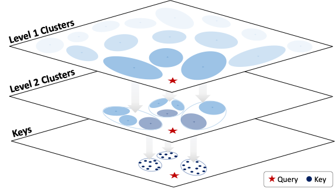

# Squeezed Attention: Accelerating Long Context Length LLM Inference



**Squeezed Attention is a method to accelerate attention for long input prompts where a large portion of the input prompt is fixed across successive user queries.**

Many LLM applications require processing long input prompts for tasks such as document analysis and code generation. However, long context length inference is prohibitively expensive since the inference costs increase linearly with sequence length. For many LLM applications, a large portion of the input prompt is fixed across successive user queries (for example, when a user asks multiple questions against a document or codebase). This means that we can perform offline optimizations which can allow us to accelerate attention for user inputs when they are received.

Squeezed Attention accelerates attention from the user input to the fixed context in the prompt by **identifying which keys are important for a given query**, and then **only computing attention with these important keys**. This identification is performed by comparing the query with clusters of keys, and then progressively refining this comparison using finer-grained clusters in order to identify the important keys for the query.

[[TLDR: Twitter Thread](TODO)]
[[Paper](https://arxiv.org/abs/2411.09688)]

---

## Installation

1. Create a conda environment
```
conda create --name fixedprompt python=3.9 -y
conda activate fixedprompt
```

2. Clone and install the dependencies (including the local transformers environment)
```
cd transformers
pip install -e .
cd ..
pip install -e .
```

---

## Offline clustering

- `run_offline_clustering.sh` provides an example of how to run offline clustering for a given LongBench dataset

---

## Online evaluation

- `LongBench/run_evaluation.sh` provides an example of how to run online evaluation for a given LongBench dataset

---

## Roadmap:
- add evaluation code for RULER
- add dataset generation and evaluation code for PreFixQA
- merge efficient kernels for generation into evaluation pipeline
- add in environment for kernel benchmarking

---

## Citation

Squeezed Attention has been developed as part of the following paper. We appreciate it if you would please cite the following paper if you found the library useful for your work:

```
@article{hooper2024squeezed,
  title={Squeezed Attention: Accelerating Long Context Length LLM Inference},
  author={Hooper, Coleman and Kim, Sehoon and Mohammadzadeh, Hiva and Maheswaran, Monishwaran and Paik, June and Mahoney, Michael W and Keutzer, Kurt and Gholami, Amir},
  journal={arXiv preprint arXiv:2411.09688},
  year={2024}
}
```

---

## Acknowledgement

This code reuses components from existing libraries including [SqueezeLLM](https://github.com/SqueezeAILab/SqueezeLLM/) and [LongBench](https://github.com/THUDM/LongBench).

The Triton kernel implementations in this repository are built on top of the [FlashAttention2 Triton Tutorial](https://triton-lang.org/main/getting-started/tutorials/06-fused-attention.html) as well as prior work on [Sparse FlashAttention kernels](https://arxiv.org/abs/2306.01160).
